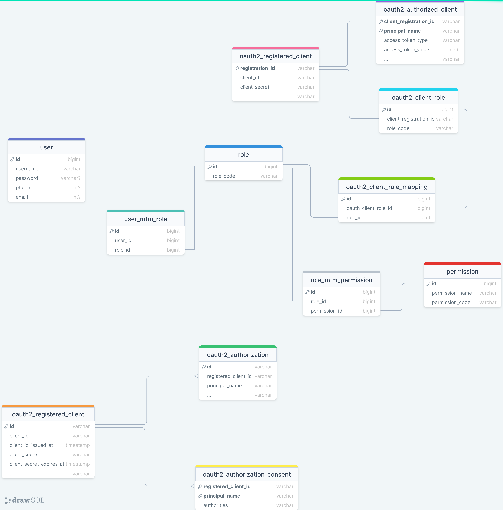

## Relevant Information:

1. `auth-server` is an authorization server built
   with [Spring Authorization Server](https://spring.io/projects/spring-authorization-server).

2. `auth-server` registers an OAuth2 client by default:
    - **clientId**: relive-client
    - **clientSecret**: relive-client
    - **redirectUri**: http://127.0.0.1:8070/login/oauth2/code/messaging-gateway-oidc
    - **scope**: openid profile email read

3. `auth-server` uses Form authentication by default, and the username and password are
   *admin/password*.

4. At the beginning of `auth-server` startup, the MySQL database username and password need to be modified, and the
   database table initialization uses the [Flyway](https://flywaydb.org/) database version control component.

5. `gateway-login` is an API gateway built by [Spring Cloud Gateway](https://spring.io/projects/spring-cloud-gateway).
   Before starting, you need to modify the **redis** configuration in `application.yml`.

6. `resourceserver` is a simple Spring Boot resource server.

## Involving Database Table Structure:

The `auth-server` database table structure is provided below, and related SQL statements are obtained
from [here](https://github.com/ReLive27/spring-security-oauth2-sample/tree/main/gateway-oauth2-login/auth-server/src/main/resources/db/migration).

## Relevant Articles:

- [Spring Cloud Gateway Combined with the Security Practice of OAuth2.0 Protocol](https://relive27.github.io/blog/spring-gateway-oauth2)
