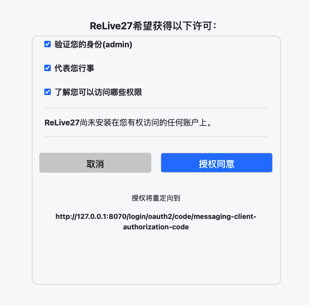

### 相关信息:
1.`oauth2-custom-consent-authorizationserver`注册了一个客户端：

- clientId: relive-client
- clientSecret: relive-client
- clientName: ReLive27

2.默认使用Form认证，注册了一个用户，admin/password  
3.启动服务访问授权接口：*http://localhost:8080/oauth2/authorize?response_type=code&client_id=relive-client&scope=message.write%20message.read%20profile&state=some-state&redirect_uri=http://127.0.0.1:8070/login/oauth2/code/messaging-client-authorization-code*
  
4.登录成功后，会看到以下自定义授权页面： 

### 相关文章:
- [自定义OAuth2授权同意页面](https://relive27.github.io/blog/custom-oauth2-consent-page)
