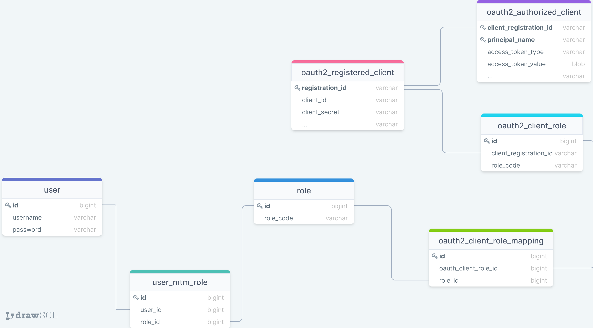

### 相关信息:
1.`idp`使用[Spring Authorization Server](https://spring.io/projects/spring-authorization-server) 构建的身份提供方服务。

2.`idp`默认注册了一个客户端:
 - **clientId**: relive-client
 - **clientSecret**: relive-client
 - **redirectUri**: http://127.0.0.1:8070/login/oauth2/code/messaging-client-oidc
 - **scope**: openid profile email

3.`idp`使用Form表单认证，用户名密码为admin/password

4.`rp`使用[Spring Security](https://docs.spring.io/spring-security/reference/servlet/oauth2/login/index.html) 构建的依赖方服务，
它包含自身支持的Form表单认证和OIDC认证

5.`rp`使用Form表单登录用户（admin/password）赋予ROLE_SYSTEM角色，拥有该角色的用户登录成功跳转到首页看到以下内容：

**Article List**
- Java
- Python
- C++

6.`rp`还将支持OAuth2登录，使用*OidcRoleMappingUserService*角色映射，将`idp`服务角色*ROLE_ADMIN*映射为`rp`服务*ROLE_OPERATION*角色，
登录成功后拥有*ROLE_OPERATION*角色的用户将在首页看到以下内容：

**Article List**
- Java

7.`rp`服务数据库表创建使用[Flyway](https://flywaydb.org/) 数据库版本控制组件，只需更改数据库用户名密码启动程序。

8.测试启动服务后，访问 http://127.0.0.1:8070/login

### 涉及数据库表结构
以下是`rp`服务相关数据库表结构：

### 相关文章:
- [Spring Security和OpenID Connect](https://relive27.github.io/blog/springn-security-oidc)
